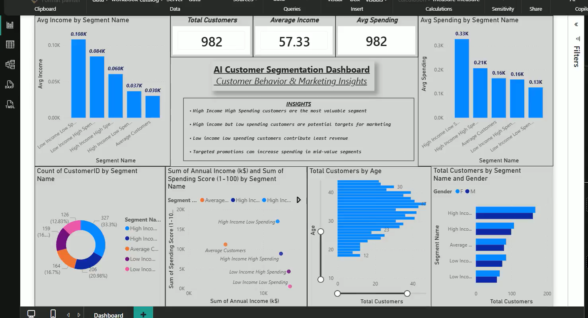

###### **AI Customer Segmentation \& Behavioral Analysis**

###### 

###### **Problem Statement**


Businesses need to understand their customers to improve marketing strategies and maximize revenue.

This project segments customers based on income and spending behavior to identify high-value customers and growth opportunities.


###### **Dataset**


The dataset includes customer attributes such as:


\* Annual Income

\* Spending Score

\* Age

\* Customer ID


Customers are grouped into segments based on behavior and value.


###### **Tools \& Technologies**


\* Python (Pandas, NumPy)

\* Data Visualization (Seaborn, Matplotlib)

\* Machine Learning (KMeans Clustering)

\* Dashboarding (Power BI)

###### 

###### **Project Workflow**


**1. Data Cleaning**


&#x20;  \* Removed duplicates and handled missing values


**2. Feature Selection**


&#x20;  \* Selected key features: income \& spending score


**3. Model Building**


&#x20;  \* Applied KMeans clustering

&#x20;  \* Used Elbow Method to determine optimal clusters


**4. Segmentation**


&#x20;  \* Grouped customers into meaningful segments


**5. Dashboard Development**


&#x20;  \* Built interactive dashboard for segment analysis

&#x20;  \* Visualized income vs spending patterns

###### 

###### **Key Insights (From Dashboard)**


**1.High-Value Customers**


\* High income + high spending customers are the most valuable segment

\* Contribute the highest revenue and should be prioritized


**2.Growth Opportunities**


\* High income but low spending customers represent untapped potential

\* Targeted marketing can increase their spending


**3.Low-Value Segment**


\* Low income + low spending customers contribute minimal revenue

\* Require cost-effective engagement strategies


**4.Customer Distribution**


\* Customer base is distributed across multiple segments

\* Balanced segmentation helps in diversified marketing


**5.Demographics Insights**


\* Majority of customers fall in mid-age groups

\* Age plays a role in spending behavior patterns


**6.Strategic Recommendations**


\* Use targeted campaigns for high-value customers

\* Personalize offers for mid-value segments

\* Optimize budget allocation across segments

###### 

###### **Dashboard Preview**


(Add your screenshot here)


###### **Business Impact**


\* Enables data-driven customer targeting

\* Improves marketing ROI through segmentation

\* Helps businesses identify high-value customers

\* Supports personalized marketing strategies

## 📸 Dashboard Preview



---

## 🎥 Demo Video

[Watch Demo](customer_segment.mp4)


###### **How to Run**


```bash id="run321"

pip install -r requirements.txt

python main.py

```

###### 

###### **Future Improvements**


\* Add real-time customer segmentation

\* Integrate recommendation systems

\* Combine with churn prediction

\* Build interactive web dashboard


###### **Author**

Thiviyesh K 

Aspiring Data Analyst 

